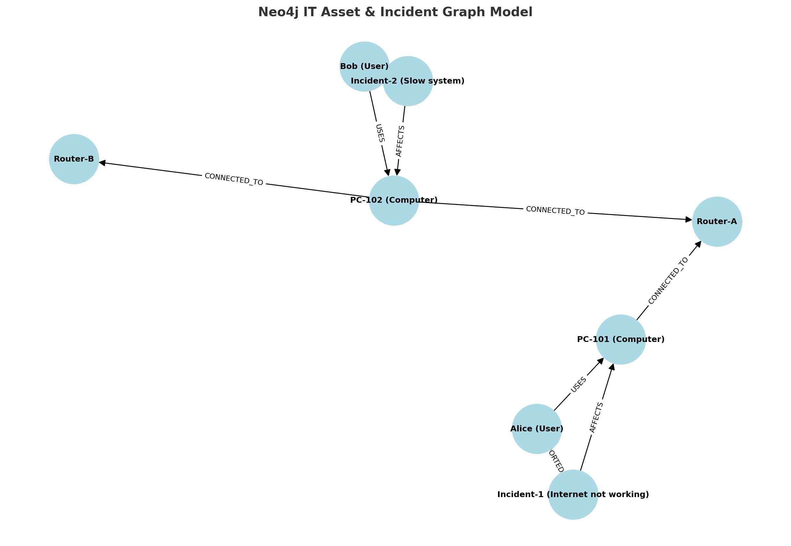

# 🚀 Managing IT Assets and Troubleshooting with Neo4j Graph Database  

In today’s IT environments, organizations deal with a growing number of users, devices, routers, and incidents. Tracking these assets and understanding the relationships between them can quickly become complex. Traditional relational databases often struggle when relationships are deep and interconnected.  

This is where **Neo4j**, a graph database, becomes very powerful. Instead of rows and columns, Neo4j stores **nodes** and **relationships**, making it easy to explore connections and patterns in IT systems.  

In this article, I’ll share how I modeled a simple **IT Asset and Incident Management system** using Neo4j.  

---

## 🗂️ Data Model  

I created the following entities (nodes) and relationships:  

- **User** – Represents employees or customers.  
- **Computer** – Workstations or laptops assigned to users.  
- **Router** – Network devices that computers connect to.  
- **Incident** – Issues reported in the system.  

**Relationships:**  
- `(:User)-[:USES]->(:Computer)`  
- `(:Computer)-[:CONNECTED_TO]->(:Router)`  
- `(:Incident)-[:REPORTED_BY]->(:User)`  
- `(:Incident)-[:AFFECTS]->(:Computer)`  
 
### 📌 Graph Diagram  



---

## ⚡ Sample Data (Cypher)  

I loaded some sample data into Neo4j using the following Cypher commands:  

```cypher
CREATE (u1:User {name: "Alice"}),
       (u2:User {name: "Bob"}),

       (c1:Computer {hostname: "PC-101"}),
       (c2:Computer {hostname: "PC-102"}),

       (r1:Router {name: "Router-A"}),
       (r2:Router {name: "Router-B"}),

       (i1:Incident {id: 1, description: "Internet not working"}),
       (i2:Incident {id: 2, description: "Slow system"}),

       (u1)-[:USES]->(c1),
       (u2)-[:USES]->(c2),

       (c1)-[:CONNECTED_TO]->(r1),
       (c2)-[:CONNECTED_TO]->(r1),
       (c2)-[:CONNECTED_TO]->(r2),

       (i1)-[:REPORTED_BY]->(u1),
       (i1)-[:AFFECTS]->(c1),

       (i2)-[:REPORTED_BY]->(u2),
       (i2)-[:AFFECTS]->(c2);
```
## 🔎 Useful Queries  

Below are some Cypher queries I used to analyze the IT Asset and Incident graph in Neo4j.  

---

### 1. Find all computers affected by incidents  
```cypher
MATCH (i:Incident)-[:AFFECTS]->(c:Computer)
RETURN i.description AS Issue, c.hostname AS Computer;
```

### 2. Find which router is linked to the most incidents 
```cypher
MATCH (i:Incident)-[:AFFECTS]->(c:Computer)-[:CONNECTED_TO]->(r:Router)
RETURN r.name AS Router, COUNT(i) AS TotalIssues
ORDER BY TotalIssues DESC;
```

### 3. Show all incidents reported by a user 
```cypher
MATCH (u:User {name:"Alice"})<-[:REPORTED_BY]-(i:Incident)
RETURN u.name AS User, i.description AS Issue;
```

### 4. Show all assets (computers) used by a user 
```cypher
MATCH (u:User)-[:USES]->(c:Computer)
RETURN u.name AS User, c.hostname AS Computer;
```

### 5. Find all users affected by incidents through their computers 
```cypher
MATCH (u:User)-[:USES]->(c:Computer)<-[:AFFECTS]-(i:Incident)
RETURN u.name AS User, COLLECT(i.description) AS ReportedIssues;
```

